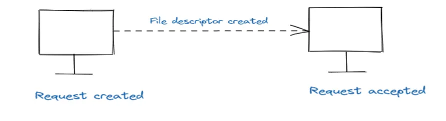

# What Are I/O-bound operations?
I/O-bounds tasks are limited by the speed of input/output operations rather than by the CPU. These tasks 
spend a significant amount of time waiting for external resources, such as reading from or writing to a disk,
making network calls, or communicating with a database.

## 2.1 How I/O-bound Tasks Work
I/O bound tasks are constrained by how fast data can be transferred between the CPU and external devices
(like hard drives or networks). Unlike CPU-bound tasks, where computation happens continuously, I/O-bound 
tasks frequently pause, waiting for data to arrive or for external systems to respond.

For instance, consider a task that reads a large file from disk:
[FileReaderDemo.java](src/computation/IO_bound/FileReaderDemo.java)

Here, the task is dependent on how fast the system can read from the disk. The CPU has little to do 
except wait for the data to become available, making this an I/O-bound operation.

## 2.2 Signs of I/O-bound Operations
Indicators that a task is I/O-bound include:

- The CPU usage is low while the task is running.
- Performance improvements when using faster storage or network solutions (SSD vs. HDD, upgrading network bandwidth).
- The task spends most of its time waiting for data or responses.

## 2.3 Optimizing I/O-bound Operations
I/O-bound tasks can be optimized in several ways:

- ***Asynchronous I/O***: Rather than blocking the main thread while waiting for I/O, asynchronous methods allow other tasks to proceed. For example, using CompletableFuture in Java for asynchronous programming.
- ***Batch Processing***: For repeated I/O tasks, processing in batches can reduce the overhead of multiple I/O operations.
- ***Caching***: Storing frequently accessed data in memory to avoid repeated I/O operations.
- ***Upgrading I/O hardware***: Investing in faster disks (e.g., SSDs) or networking components.

## 3. Understanding the Balance: Mixed CPU and I/O-bound Operations
Some tasks might involve a mix of both CPU and I/O-bound operations. For instance, a web server handling 
requests from clients is often both CPU-bound (when processing data) and I/O-bound (when reading from or writing 
to databases). Managing such tasks efficiently requires understanding both CPU and I/O limitations.

## 3.1 Example of Mixed CPU and I/O-bound Task
Consider a web server that processes user requests, performs calculations, and fetches data from a database. 
Here’s a simplified example in Java:
[MixedTaskDemo.java](src/computation/IO_bound/MixedTaskDemo.java)

This example showcases both CPU-bound (computation) and I/O-bound (simulated database access with Thread.sleep) 
operations. Balancing these two types of operations is key to optimizing such mixed workloads.

## 3.2 Optimizing Mixed Operations
When dealing with mixed workloads, here are some strategies for optimization:

- ***Use Multi-threading or Asynchronous Techniques***: Divide CPU and I/O tasks among multiple threads or use asynchronous processing to prevent blocking.
- ***Prioritize Tasks Appropriately***: Use proper task scheduling to ensure CPU-bound tasks don’t block I/O-bound ones, or vice versa.
- ***Leverage Caching and Preprocessing***: Minimize repetitive I/O operations by caching frequently accessed data or preprocessing tasks in advance.

## 4. Conclusion
Understanding the distinction between CPU-bound and I/O-bound tasks is essential for optimizing software performance. 
CPU-bound tasks are limited by the processor, while I/O-bound tasks are constrained by external systems like disks 
or networks. By knowing where your bottleneck lies, you can choose the appropriate optimization strategy — whether 
that’s improving algorithm efficiency, upgrading hardware, or leveraging asynchronous I/O.

