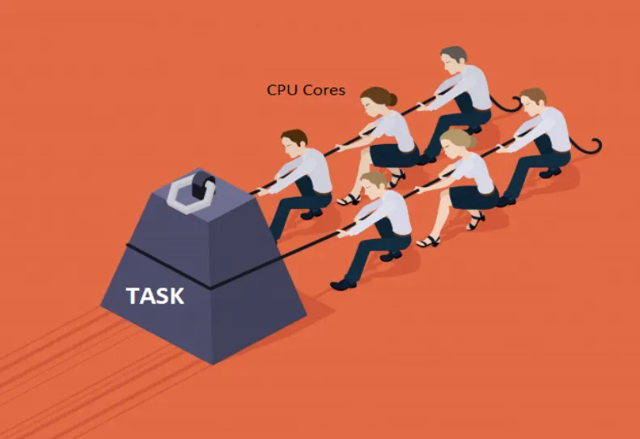

# CPU-bound

CPU-bound tasks are those where the speed of execution is limited by the processor's speed. In other words,
the CPU is the bottleneck. These operations often involve heavy computation, such as performing complex 
calculations or processing large datasets.

## 1.1 How CPU-bound Tasks Work
CPU-bound tasks continually keep the CPU busy, fully utilizing the processing power. Because they involve minimal
waiting for external systems (such as file or network access), adding more CPU power or optimizing code performance
directly influences the task's efficiency.

For example, Let's look at common CPU-bound operation: calculating large prime numbers.
[PrimeNumberCalculator.java](src/computation/cpu_bound/PrimeNumberCalculator.java)

In the example above, the CPU does all the work. The more efficient your processor, the faster this task run.
There are no I/O operations here; the bottleneck lies entirely in how quickly the CPU execute mathematical 
operations.

## 1.2 Signs of CPU-bound operations
Common signs that a task is CPU-bound include:

- High CPU usage when the task is running.
- Performance improvement when upgrading to a faster CPU.
- Minimal wait time for disk, network, or other external resources.

## 1.3 Optimizing CPU-bound Operations

- Using efficient algorithms (e.g. replacing brute force algorithms with more optimized ones)
- Parallelizing the workload across multiple threads or processors.
- Leveraging libraries or hardware acceleration where applicable (e.g. GPU computing for mathematical tasks)