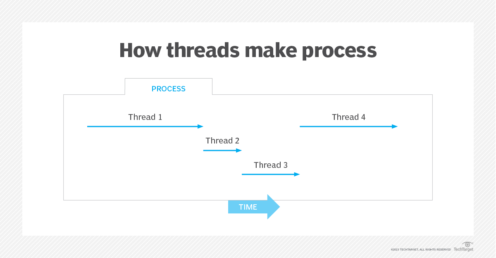

## What are Threads?

Threads are small units of a computer program that can run independently. They allow a program to perform multiple tasks
at the same time, like having different parts of the program run simultaneously. This makes programs more efficient
and responsive, especially for tasks that can be divided into smaller parts.

Each thread has:
- A thread ID is a mens of identifying and tracking the thread.
- A program counter tracks the memory location of the instruction being executed in the thread.
- A register set includes temporary memory locations used to store data and processing results from the thread.
- A stack is memory space allocated to the thread and used while the thread is executing.

Threads are not independent of each other as they share the code, data, OS resources, etc.
Threads allow multiple tasks to be performed simultaneously within a process, making them a fundamental concept
in modern operating systems.

A process is normally comprised of multiple (often many) individual threads, which are frequently termed lightweight processes.

